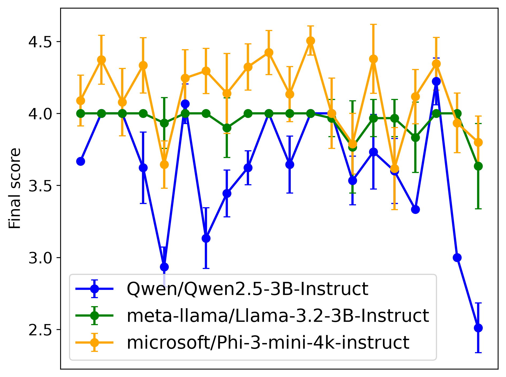
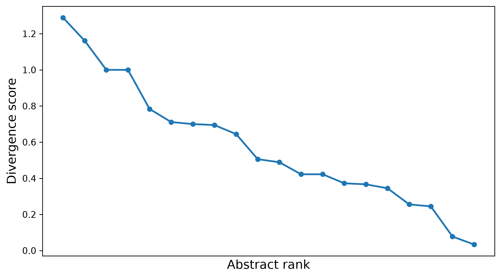
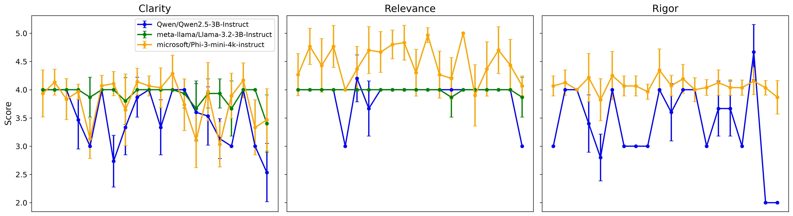

# LLMs as Scientific Abstract Evaluators

This is a small exploratory project developed to strengthen my Python and LLM evaluation skills while investigating the behavior of language models when asked to evaluate scientific text.

The project uses biomedical abstracts as a convenient proxy for scientific documents. Abstracts are short, relatively self-contained, and can be evaluated locally using small open-source language models without substantial computational requirements.

The current objective is to investigate **the variability and stability of LLM-generated evaluation scores**, both across repeated runs of the same model and across different models.

## Experimental setup

Each model is asked to evaluate biomedical abstracts according to three simplified criteria:

* **Clarity**
* **Relevance**
* **Apparent methodological rigor**

A score from **0 (lowest) to 5 (highest)** is generated independently for each criterion. A simple arithmetic mean of the three scores is also calculated as a composite score.

The evaluation prompts are intentionally simple. The purpose of this project is not to construct or validate a rigorous scientific-review system, but to explore the behavior and reproducibility of LLM-based scoring under controlled conditions.

In particular:

* no reference or human-derived scores are used as ground truth;
* the evaluation rubrics are deliberately minimal;
* relevance is not anchored to a specific research question or funding context;
* methodological rigor can only be inferred from information presented in the abstract;
* the composite score is an exploratory summary rather than a validated metric.

A more realistic evaluation system would require richer rubrics, contextual information, calibration examples, domain-specific instructions, and validation against appropriate external criteria.

## Evaluation criteria

### Clarity

| Score | Interpretation      |
| ----: | ------------------- |
|     0 | Extremely unclear   |
|     1 | Very unclear        |
|     2 | Somewhat unclear    |
|     3 | Reasonably clear    |
|     4 | Very clear          |
|     5 | Exceptionally clear |

### Relevance

| Score | Interpretation         |
| ----: | ---------------------- |
|     0 | Not relevant           |
|     1 | Very low relevance     |
|     2 | Somewhat relevant      |
|     3 | Reasonably relevant    |
|     4 | Very relevant          |
|     5 | Exceptionally relevant |

### Apparent methodological rigor

| Score | Interpretation                                           |
| ----: | -------------------------------------------------------- |
|     0 | No identifiable scientific rigor                         |
|     1 | Very low apparent rigor                                  |
|     2 | Limited apparent rigor                                   |
|     3 | Reasonable apparent rigor                                |
|     4 | High apparent rigor, with minor limitations              |
|     5 | Exceptionally rigorous based on the information provided |

## Models

The current experiments use three small instruction-tuned models available through Hugging Face:

* `microsoft/Phi-3-mini-4k-instruct`
* `Qwen/Qwen2.5-3B-Instruct`
* `meta-llama/Llama-3.2-3B-Instruct`

Models are evaluated using the same abstracts, prompts, scoring criteria, and generation settings wherever possible.

## Results

These are some preliminary results, focusing on within- and inter-model variability, as well as divergence between models.

In Table 1, I show some general statistics on the overall results (range of final score given by different models and centrality metrics). This analysis shows that the range of final scores
was different between models, even though most final scores were close to 4 out of 5. This indicates that all models tend to be generous in their evaluation, even though they differ quite a lot in the details. Indeed, some were more generous (Phi-3), while some were more strict (Qwen). The most consistent model was Llama, while the least was Qwen.

*Table 1. Centrality metrics for final score obtained for a sample of 20 abstracts, for each model.*

| model                            |     min |     max |    mean |      std |   median |
|:---------------------------------|--------:|--------:|--------:|---------:|---------:|
| Qwen/Qwen2.5-3B-Instruct         | 2.33333 | 4.33333 | 3.60333 | 0.455435 |  3.66667 |
| meta-llama/Llama-3.2-3B-Instruct | 3       | 4       | 3.94833 | 0.163052 |  4       |
| microsoft/Phi-3-mini-4k-instruct | 3       | 5       | 4.12778 | 0.32028  |  4.16667 |

The variability and range of final scores can be misleading, because they collapse together information from different abstracts. And considering that the prompts were intentionally quite simple, they provided few details and no examples on how to do the evaluation. This means that the same abstract might be interpreted differently by different models. Below, we show the variability of final scores that models gave to each abstract (Figure 1).

  

*Figure 1. Mean ± standard deviation of final score per title and model.*

Key takes from Figure 1:
- Lama gave the same final score to most abstracts, indicating potential flaws in its reasoning and explaining why it was the most consistent. This also highlights that model consistency, in itself, is an insufficient indicator of model reliability;
- Phi-3, on the other hand, provided different scores depending on abstract. The variance between different abstracts evaluation by Phi-3 did not overlap, meaning that each abstract obtained a specific evaluation, instead of repeating the same score for different abstracts (as it seems to be the case for Lama);
- Qwen presented the most variance between different abstracts, but the variability within abstracts was not higher that those of Phi-3. This indicates that Qwen provided the evaluations that were most specific to each abstract, even though the prompt provided very few details.

Relative differences in final scores across abstracts was consistent across models (visible along the x-axis), whereby the same abstracts tended to have lower or higher scores, but different magnitudes. However, it is notable that the models provided very similar final scores for some abstracts, while other obtained very different results. Thus, we next inspected the absolute divergence between model's final score for each abstract, and ranked them from most divergent to least divergent (Figure 2), in absolute terms.

  

*Figure 2. Divergence in mean final score across models for each abstract, ranked from highest to lowest disagreement.*

Figure 2 simply indicates the rate of decreasing divergence, but the most interesting part is to analyze the two extreme points, _i.e._, the abstract with most divergence and the abstract with least divergence.

- **Most divergent abstract**

**Ttile**: Synthesis of N-substituted isoindolines.
**Abstract**: Some derivatives of isoindoline were prepared in order to test their cardiovascular activity. Pharmacological tests showed that some of the compounds had moderate alpha-blocking and coronarodilatory activity whereas others had some local anesthetic activity.
**Reference**: Chimenti, F., & Vomero, S. (1975). [Synthesis of N-substituted isoindolines]. Il Farmaco; Edizione Scientifica, 30(11), 884–890. PMID: 251.

- **Least divergent abstract**

***Title**: Phospholipase D activity of gram-negative bacteria.
**Abstract**: A phospholipase hydrolyzing cardiolipin to phosphatidic acid and phosphatidyl glycerol was characterized in gram-negative bacteria but was absent in preparations of gram-positive bacteria, *Saccharomyces cerevisiae*, and rat liver mitochondria. In cell-free extracts of *Escherichia coli*, *Salmonella typhimurium*, *Proteus vulgaris*, and *Pseudomonase aeruginosa*, this cardiolipin-hydrolyzing enzyme had similar pH and Mg2+ requirements and displayed a specificity which excluded phosphatidyl glycerol and phosphatidyl ethanolamine as substrates.
**Reference**: Cole, R. M., & Proulx, P. (1975). Phospholipase D activity of gram-negative bacteria. Journal of Bacteriology, 124(3), 1148–1152. https://doi.org/10.1128/jb.124.3.1148-1152.1975. PMID: 360.

Both abstracts were from 1975! However, they presented quite different results of score divergence between models. *The abstract with most divergence* between models was composed of only two sentences. It is a very simple abstract, which provides very few methodological details or any claims of relevance. Thus, there was very little information for the models to base their evaluation on, which is the most likely explanation for the abstract scoring. The abstract itself is not terrible, because it very elegantly and simply explained the scientific experiment, *i.e.* they prepared derivatives of isoindoline to test their cardiovascular activity. As for the **abstract with least divergence** it was bigger and it included more methodological information. Thus, it had more information to gauge the different criteria. Overall, it seems that models made very different predictions of scoring based, mostly, on a **lack of information**: they both missed details on evaluation criteria (prompt-level) and they tended to become unstable if the abstract also provided little information. In other words, in the absence of sufficient information (context and prompt wise), the models hallucinate evaluation scores.

Finally, I looked into the individual criteria scores in Figure 3.

  

*Figure 3. Mean ± standard deviation of Clarity, Relevance, and Rigor scores per title and model.*

Figure 3 is interesting, because it shows what metrics mattered the most to explain the final score given by the models. Notably, **Rigor** scoring failed for the Lama model, which is the most likely explanation for the lack of specificity in its scoring of different abstracts. **Relevance** seems to explain the overestimation of the final score by Phi-3, thus, Phi-3 tends to consider abstracts to be generally more relevant, while the other models seem to be more stringent. Again, this might be a direct consequence of the lack of detail in the prompts. And **Clarity** was the most consistent score between different models, which makes sense, as clarity has to do with the text construction, which is something an LLM can handle more easily than gauging the relevance and scientific rigor based only on an abstract. Indeed, we can evaluate an abstract for it's clarity based solely on the abstract, but measuring it's relevance and rigor from so little information, is always trickier. In a normal setting, to better evaluate the relevance and rigor of the abstract of a paper, we would also need to read the paper.

## Scope

This repository is an exploratory Python/LLM project. I'm using to train LLM workflows, test code, explore model evaluation.

## Learning resources

Alammar, J., & Grootendorst, M. (2024). Hands-On Large Language Models: Language Understanding and Generation. O’Reilly Media.

## Generative AI use declaration
I used generative AI (chatGPT) to review and improve the text in this README file.

